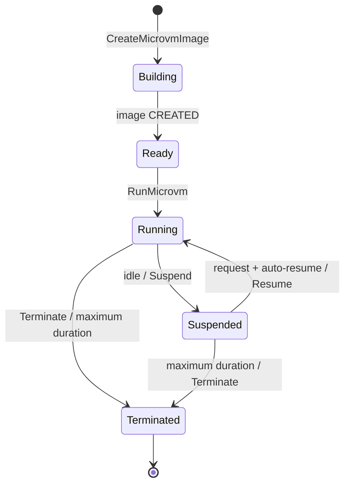
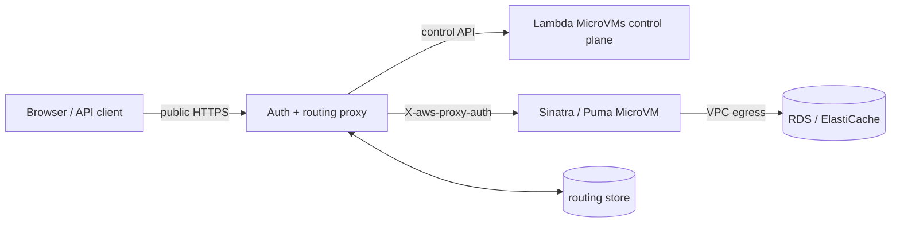

# AWS Lambda MicroVMs 調査メモ

最終更新: 2026-07-30 (UTC)

## 0. 調査結果の扱い

本書は、依頼時に提示された情報を出発点に、既存の AWS Lambda、Firecracker、
Amazon Linux 2023 (AL2023)、Ruby/Sinatra の公開仕様と突き合わせた設計前調査である。

> **重要な検証ステータス**
>
> この作業環境から AWS の Web 検索および AWS CLI/API に接続できなかったため、
> 「Lambda MicroVMs が 2026-06-22 に GA」「東京リージョン対応」、サービス固有の
> API 名、ARN、上限、料金、ベースイメージ名は一次資料で独立に再確認できていない。
> したがって、以下では依頼時情報を **候補仕様** として整理し、実装開始前に確認すべき
> 項目を明示する。未検証の値を本番契約として扱ってはならない。

既存サービスについて参照した一次資料:

* [AWS Lambda quotas](https://docs.aws.amazon.com/lambda/latest/dg/gettingstarted-limits.html)
* [AWS Lambda container images](https://docs.aws.amazon.com/lambda/latest/dg/images-create.html)
* [AWS Lambda execution environment](https://docs.aws.amazon.com/lambda/latest/dg/lambda-runtime-environment.html)
* [Firecracker](https://firecracker-microvm.github.io/)
* [Amazon Linux 2023 package repository](https://docs.aws.amazon.com/linux/al2023/ug/package-management.html)
* [Sinatra README](https://github.com/sinatra/sinatra/blob/main/README.md)
* [Puma documentation](https://puma.io/)

## 1. 要約

依頼時情報によれば、Lambda MicroVMs は従来 Lambda Functions の上位プランではなく、
Lambda ブランドに加わった別のコンピュートモデルである。Functions がイベント単位で
ハンドラーを呼ぶのに対し、MicroVMs は利用者が API から MicroVM を作成、停止、再開、
破棄し、その中で通常の Linux アプリケーションプロセスを動かす。

Sinatra と Puma は ARM64 Linux 上で通常の HTTP サーバーとして動くため、技術的には
適合する。一方、VM ごとの認証必須 URL、最大生存時間、明示的な配置・ルーティング、
スナップショット安全性をアプリ側で扱う必要がある。そのため最適な用途は、テナント別
環境、プレビュー、サンドボックス、8 時間以内の一時環境であり、単一 VM を無期限に
公開する一般的な Web ホスティングではない。

## 2. 従来 Lambda Functions との比較

以下の MicroVMs 列は依頼時情報に基づくため、正式なサービスドキュメントで要再確認。

| 項目 | Lambda Functions | Lambda MicroVMs（候補仕様） |
| --- | --- | --- |
| 実行モデル | イベントをハンドラーへ渡す | Linux 上で通常の常駐プロセスを起動 |
| 主用途 | API、イベント処理、短時間バッチ | サンドボックス、開発環境、テナント別環境、CI/CD |
| 生存時間 | 1 invocation 最大 15 分 | 作成から最大 28,800 秒。停止時間を含む |
| 状態 | 実行環境の再利用は保証されない | メモリとディスクを suspend/resume 可能 |
| HTTP | Function URL/API Gateway がイベント化 | VM 内 HTTP サーバーへ直接転送 |
| プロトコル | 通常は HTTP イベント。WebSocket は別サービス | HTTP/1.1、HTTP/2、WebSocket、gRPC、SSE |
| エンドポイント | 関数または Alias 単位 | MicroVM ごとの固有 HTTPS URL |
| 認証 | IAM または公開設定 | VM・ポート・期限に束縛された JWE が必須 |
| スケール | Lambda が自動スケール | `RunMicrovm` 相当を呼び、ルーティングも利用者が管理 |
| アーキテクチャ | x86_64 / arm64 | arm64 のみ |
| メモリ | 128–10,240 MB | 基準 0.5–8 GB、最大 4 倍への垂直変更 |
| ディスク | `/tmp` 最大 10,240 MB | 基準メモリに応じ 8–32 GB、停止中も保持 |
| イメージ | Lambda Runtime API 対応が必要 | 通常の Linux コンテナから VM image を構築 |
| OS 権限 | 非特権、読み取り専用 root FS | shell、任意 capabilities（必要時のみ） |
| VPC | Lambda VPC attachment | VPC Egress Connector |
| 課金 | request + GB-second | running second + snapshot read/write/storage |
| 終了 | ローカル状態は非永続 | terminate すると VM 内部状態を喪失 |

## 3. ライフサイクル

候補となる状態遷移は次の通り。



アプリケーションには `/ready`、`/validate`、`/run`、`/suspend`、`/resume`、
`/terminate` のライフサイクルフックが通知されるという前提を置く。ただし、正確な URL、
HTTP method、payload schema、timeout、retry、失敗時動作、呼び出し順は **未検証** である。

最大 8 時間はサスペンドしても延長されない。永続化すべき状態は RDS、DynamoDB、S3 等へ
書き出し、新しい VM が再構成できることが必須となる。

## 4. ネットワークと認証

VM の ingress endpoint は VM ごとに異なり、リクエストには次のヘッダーが必要とされる。

```http
X-aws-proxy-auth: <short-lived JWE token>
```

トークンは少なくとも MicroVM ID、許可 port、有効期限に束縛される想定である。ブラウザへ
直接払い出すと URL と bearer token の漏えい、更新、失効管理が難しい。公開サービスでは、
固定 URL を持つ制御プロキシだけが token を保持する。



単一 URL に対する組み込みロードバランサーはない前提であり、プロキシは
`tenant_id -> microvm_id, endpoint, state, generation, expires_at` を保存する。再試行時に
二重起動しない idempotency key と、期限切れ VM を置換する generation compare-and-swap が必要。

## 5. 実行環境とイメージ

### 5.1 ARM64

MicroVMs は ARM64/Graviton のみという前提のため、イメージは `linux/arm64` で構築する。
Ruby 自体に問題はないが、native extension を含む gem と外部バイナリを検査する。

```bash
bundle lock --add-platform aarch64-linux
docker buildx build --platform linux/arm64 --load -t sinatra-microvm:test .
```

### 5.2 スナップショット安全性

image build 時のプロセス・メモリ・ディスクを複製する設計では、次を image に焼き込まない。

* UUID、instance/tenant ID、セッション、nonce、秘密鍵
* PRNG state からの一意性を仮定する値
* DB/socket connection、file descriptor、lock
* 短期 credential、期限付き DNS/TLS state

`run` で VM 固有 ID と秘密情報を取得し直し、`suspend` で書き込みを flush して接続を閉じ、
`resume` で DB pool、DNS、credential を再作成する。秘密情報は環境変数や image layer ではなく、
実行時に Secrets Manager 等から取得する。OpenSSL/PRNG の snapshot safety は AWS 推奨の
MicroVM 用 AL2023 base image の正確な保証範囲を一次資料で確認する。

## 6. Sinatra との適合性

Sinatra は Rack application、Puma は通常の TCP listener なので、Runtime API adapter は不要。
Puma を `0.0.0.0:8080`（または許可した任意 port）へ bind するだけで HTTP 転送を受けられる。

適合する機能:

* Puma/Sinatra、FastAPI、Node.js 等の常駐 HTTP server
* WebSocket、gRPC、SSE 等の長時間 connection
* background/child process、cron 相当処理
* tenant/job/agent ごとの隔離
* process memory と working directory を保つ suspend/resume
* RDS、ElastiCache、private API への VPC egress
* 必要時の shell、mount、namespace、eBPF

ただし Puma の複数 worker は snapshot と connection draining を複雑にする。最初の検証では
single worker / 複数 thread とし、`preload_app!` や worker fork は採用しない。

## 7. 制約と対策

1. **最大 8 時間** — 外部永続化、終了時刻前の drain、新 VM への世代交代を設計する。
2. **匿名 ingress 不可** — 公開 proxy を置き、JWE を server side のみで扱う。
3. **自動 load balancing なし** — routing store と placement/reconciliation worker を用意する。
4. **ARM64 のみ** — lockfile platform、image manifest、native gems を CI で検証する。
5. **event source mapping なし** — S3/SQS/EventBridge は Functions 等で受け control/API を呼ぶ。
6. **snapshot clone hazards** — run/resume hook で identity、secret、connection を再生成する。
7. **terminate で local state 喪失** — local disk は cache/workspace とし、system of record にしない。
8. **hook delivery の不確実性** — terminate hook の成功を永続化保証にせず、定期 checkpoint する。
9. **endpoint churn** — endpoint を client に保存せず、proxy の安定 URL を唯一の入口にする。
10. **長時間 connection** — suspend/drain 条件、最大 connection 時間、resume 中の応答を定義する。

## 8. 用途別判断

| 用途 | 判断 | 理由 |
| --- | --- | --- |
| ユーザー別 Sinatra workspace | 推奨候補 | 隔離と suspend/resume が価値になる |
| AI 生成アプリの preview | 推奨候補 | 短命・非信頼コード隔離に合う |
| 8 時間以内の demo/dev 環境 | 推奨候補 | 常時課金を避け、状態を一時保持できる |
| 通常の stateless API | 原則 Functions | event scaling と固定 endpoint が簡単 |
| 一般公開の常時稼働 Web | 原則 ECS/App Runner 等 | 8 時間上限、token proxy、routing が過剰 |
| GPU/x86 専用処理 | 不適 | arm64 のみ、専用 hardware なし |

## 9. 東京リージョンでの検証候補手順

以下は依頼時に提示された **仮の CLI syntax** を再現したもの。CLI service prefix、引数名、
base image ARN、connector ARN は `aws <service> help` と公式 API reference で置換してから実行する。

```bash
zip -r sinatra-microvm.zip Dockerfile Gemfile app.rb config.ru
aws s3 cp sinatra-microvm.zip s3://YOUR_BUCKET/sinatra-microvm.zip \
  --region ap-northeast-1

aws lambda-microvms create-microvm-image \
  --name sinatra-microvm \
  --code-artifact uri=s3://YOUR_BUCKET/sinatra-microvm.zip \
  --base-image-arn arn:aws:lambda:ap-northeast-1:aws:microvm-image:al2023-1 \
  --build-role-arn arn:aws:iam::ACCOUNT_ID:role/MicrovmBuildRole \
  --region ap-northeast-1

aws lambda-microvms run-microvm \
  --image-identifier sinatra-microvm \
  --ingress-network-connectors \
    arn:aws:lambda:ap-northeast-1:aws:network-connector:aws-network-connector:ALL_INGRESS \
  --egress-network-connectors \
    arn:aws:lambda:ap-northeast-1:aws:network-connector:aws-network-connector:INTERNET_EGRESS \
  --maximum-duration-in-seconds 3600 \
  --idle-policy \
    '{"autoResumeEnabled":true,"maxIdleDurationSeconds":300,"suspendedDurationSeconds":1800}' \
  --region ap-northeast-1

aws lambda-microvms create-microvm-auth-token \
  --microvm-identifier MVM_ID \
  --expiration-in-minutes 30 \
  --allowed-ports '[{"port":8080}]' \
  --region ap-northeast-1

curl --fail-with-body https://MVM_ENDPOINT/ \
  -H 'X-aws-proxy-auth: TOKEN'
```

### 9.1 AWS CDK での管理方針

デプロイと永続インフラは AWS CDK（TypeScript）を唯一の IaC entry point とする。手作業の
CLI は調査・障害解析に限定し、通常の環境構築手順にはしない。

現時点では Lambda MicroVMs に対応する CDK L2 construct および CloudFormation resource type
を一次資料で確認できていない。このため、次の優先順位で実装方式を決める。

1. CloudFormation resource type があれば CDK の L1 (`Cfn*`) を使う。
2. L1 が未生成なら `CfnResource` で正式な CloudFormation type を使う。
3. CloudFormation 未対応の **永続リソース** に限り、Lambda MicroVMs API を呼ぶ CDK custom
   resource provider を使用する。create/update/delete、stabilization、rollback、物理 ID を実装する。
4. `RunMicrovm`、resume、token 発行などの **実行時操作** は CloudFormation/custom resource
   ではなく control proxy/reconciler が行う。

MicroVM 個体は最大生存時間を持つ ephemeral runtime なので、CDK stack の resource として
1 台ずつ管理しない。CDK が管理するのは image definition/build pipeline、network connector、
IAM、routing table、proxy、reconciler、logs/alarms 等の desired infrastructure である。

image build が非同期かつ CloudFormation timeout を超え得る場合、custom resource Lambda 内で
待ち続けない。CodeBuild/Step Functions 等へ処理を委譲し、provider の `isComplete` polling または
deployment pipeline の別 stage で完成を待つ。image version/digest を deployment artifact として
固定し、stack rollback 時にも既存世代を直ちに削除しない。

## 10. 実装前に一次資料で閉じる項目

| 優先度 | 未確認事項 | 完了条件 |
| --- | --- | --- |
| P0 | GA 日、`ap-northeast-1` availability | AWS announcement と region table の URL を記録 |
| P0 | CLI/API service name と全 schema | 最新 AWS CLI で help を保存し dry-run 相当まで成功 |
| P0 | image/connector ARN | account 上で describe/list し、hard-code を排除 |
| P0 | lifecycle hook contract | path、payload、timeout、retry、順序を contract test 化 |
| P0 | 最大 duration と suspend 中の算入 | quota/API docs と実測が一致 |
| P0 | token contract | scope、最大 TTL、rotation、revocation、header 名を実測 |
| P0 | CDK/CloudFormation coverage | resource type、L1、API custom resource の必要範囲を確定 |
| P1 | memory/disk/vertical scale | 許容値、状態遷移、課金影響を確認 |
| P1 | network protocol support | HTTP/2、WS、gRPC、SSE を end-to-end test |
| P1 | snapshot crypto safety | base image の保証と Ruby/OpenSSL version を記録 |
| P1 | price/quota | Tokyo price と account quota を cost model に反映 |
| P2 | shell/capabilities/eBPF | threat model に必要な場合だけ最小権限で検証 |

## 11. 結論

Sinatra を動かす方式自体は技術的に妥当である。ただし、サービス固有情報が一次資料で
独立検証できていない現時点では、本番採用を確定しない。まず SPEC.md の検証ゲートを満たし、
特に lifecycle hook、8 時間終了、JWE proxy、snapshot 復元を実機で確認する。
