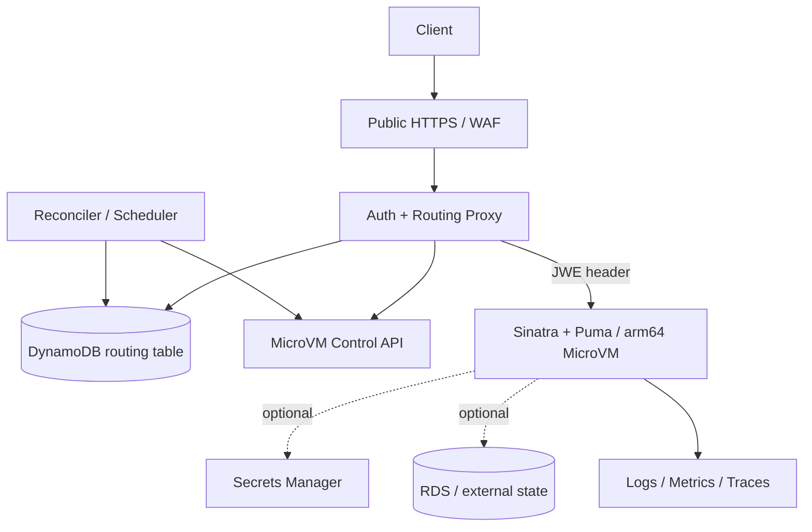

# Sinatra on AWS Lambda MicroVMs 仕様設計

最終更新: 2026-07-30 (UTC)  
状態: Core PoC implemented / AWS account end-to-end deploy 前

## 1. 目的

テナントごとに分離された一時的な Sinatra application を Lambda MicroVMs 上で実行し、
外部利用者には安定した HTTPS endpoint を提供する。MicroVM 固有 endpoint と認証 token は
公開せず、最大生存時間を越えても外部永続状態から安全に再作成できるようにする。

本仕様は短命な preview/workspace を対象とする。一般公開の常時稼働 Web site を 1 台の VM
で提供することは対象外。service/API/CloudFormation/CDK contract は 2026-07-30 時点の AWS
一次資料で確認済み。account quota と deploy/runtime 動作は実機検証前。

## 2. 要求

### 2.1 機能要求

* `GET /` は JSON の health/demo response を返す。
* public proxy は利用者を認証し、tenant に対応する running VM へ request を転送する。
* VM がない場合は 1 台だけ作成し、起動完了後に転送する。
* suspended VM への request は auto-resume または明示 resume 後に転送する。
* idle 時に suspend し、最大 duration 前に新 VM へ世代交代する。
* lifecycle hook で connection 解放・再接続と checkpoint を行う。現行のstateless demoでは
  外部connectionがないため、readiness遷移以外はno-opとする。
* durable tenant dataを追加する場合、terminate後も外部storeから復元できること。

### 2.2 非機能要求

| 項目 | 初期 SLO / 方針 |
| --- | --- |
| availability | proxy 月間 99.9%。preview VM 自体は best effort |
| warm latency | p95 500 ms 未満（application response を除く） |
| resume latency | 計測後 SLO 化。初期 timeout 30 秒 |
| cold start | 計測後 SLO 化。初期 timeout 120 秒 |
| isolation | 1 tenant / 1 MicroVM。tenant 間で local state 非共有 |
| durability | local disk は非永続。system of record は外部 managed store |
| architecture | linux/arm64 image のみ |
| observability | request ID、tenant hash、VM ID、generation、lifecycle event を相関可能 |
| recovery | control-plane 操作は冪等。stale mapping を自動 reconcile |

## 3. 非対象

* 単一 MicroVM の無期限運用
* MicroVM endpoint の browser への直接公開
* 組み込み機能を仮定した複数 VM load balancing
* local disk を唯一の database とする構成
* x86_64 native binary、GPU workload
* S3/SQS/EventBridge から MicroVM への直接 event source mapping

## 4. アーキテクチャ



### 4.1 component responsibility

| Component | Responsibility |
| --- | --- |
| Edge/WAF | TLS、rate limit、coarse attack filtering |
| Proxy | user auth、tenant resolution、token mint/cache、request forwarding |
| Routing store | desired/observed state、generation、lease、endpoint metadata |
| Reconciler | orphan cleanup、duration 前の rotation、failed transition recovery |
| Sinatra VM | tenant workload と lifecycle hook |
| External state | durable data追加時のsecret、artifact、checkpoint。現行demoでは未使用 |

## 5. Routing data model

DynamoDB table `microvm_routes` の候補 schema:

| Attribute | Type | Note |
| --- | --- | --- |
| `tenant_id` | string (PK) | raw 値の log 出力は禁止 |
| `generation` | number | VM 置換ごとに単調増加 |
| `microvm_id` | string | control plane resource ID |
| `endpoint` | string | server side only |
| `state` | enum | `PROVISIONING/RUNNING/SUSPENDED/DRAINING/FAILED` |
| `image_version` | string | immutable digest/version |
| `lease_owner` | string | provision operation owner |
| `lease_expires_at` | number | stuck operation 回収用 epoch seconds |
| `created_at` | string | RFC 3339 |
| `hard_expires_at` | string | maximum duration より safety margin 分早い |
| `last_access_at` | string | idle policy/reconciliation 用 |
| `version` | number | optimistic locking |

endpoint と token を client response、access log、trace attribute に含めない。JWE token は原則
永続化せず、proxy memory cache に expiration より短い TTL で保持する。

## 6. Request flow

1. Edge が request ID を付与し、proxy が user を認証する。
2. proxy は user claim から tenant ID を決定する。client 指定値を信用しない。
3. route が `RUNNING` なら短期 JWE を取得/cache し VM へ転送する。
4. route が `SUSPENDED` なら auto-resume を有効にした endpoint へ転送する。Lambda は
   `/resume` 完了まで最初の request を保持する。
5. route がない/期限切れなら conditional write で lease を 1 caller だけが取得し起動する。
6. 他 caller は bounded backoff で route を監視し、重複 VM を作らない。
7. upstream の 401/403 は token を 1 回だけ更新して retry する。
8. network/5xx は idempotent method のみ 1 回 retry。非 idempotent request は自動 retry しない。
9. hard expiry safety margin 内なら新 generation を作り、旧 VM を drain 後 terminate する。

Provisioning 中は `202 Retry-After` または同期 wait を API ごとに選べるようにする。初期 demo は
API Gateway の integration window 内で最大 10 秒待ち、未完了なら `202 Retry-After: 2` と
request ID を返す。

## 7. Sinatra application contract

### 7.1 public application endpoint

`GET /`:

```json
{
  "message": "Sinatra on Lambda MicroVMs",
  "pid": 123,
  "generation": 7
}
```

production では PID は debug 情報のため削除可能。response header に `X-Request-Id` を返す。

`GET /health/live` は process 生存のみ、`GET /health/ready` は request 受付可否を返す。
draining/suspending 中の readiness は `503`。

### 7.2 lifecycle hook

prefix は `/aws/lambda-microvms/runtime/v1`。hook は image の `Hooks` で `ENABLED` にし、
port 8080 を指定する。

| Hook | Required behavior | Idempotency |
| --- | --- | --- |
| `ready` | boot 完了と listener 準備を返す | 何度でも 200 |
| `validate` | app/config が snapshot 可であることを返す | read-only |
| `run` | service supplied `microvmId` と `runHookPayload` から generation を初期化 | 同じ identity の再呼出し可 |
| `suspend` | readiness off、request drain、flush、DB pool disconnect | 再呼出し可 |
| `resume` | PRNG/identity 確認、credential 更新、DB pool reconnect、readiness on | 再呼出し可 |
| `terminate` | readiness off、best-effort checkpoint、connection close | 再呼出し可 |

public proxy は hook prefix を転送せず常に `404` にする。MicroVM endpoint と port-scoped JWE は
proxy のみが保持し、browser/client には渡さない。AWS が送らない独自 header を hook に要求して
lifecycle call を妨げてはならない。

terminate hook は delivery や完了を保証されると仮定しない。durable update は request transaction
または定期 checkpoint で行う。

### 7.3 minimal application skeleton

```ruby
require "json"
require "sinatra/base"

class App < Sinatra::Base
  HOOK_PREFIX = "/aws/lambda-microvms/runtime/v1"

  before { content_type :json }

  get "/" do
    {
      message: "Sinatra on Lambda MicroVMs",
      pid: Process.pid,
      generation: ENV.fetch("APP_GENERATION", "unknown")
    }.to_json
  end

  get "/health/live" do
    { status: "ok" }.to_json
  end

  post "#{HOOK_PREFIX}/ready" do
    status 200
  end

  post "#{HOOK_PREFIX}/validate" do
    status 200
  end

  post "#{HOOK_PREFIX}/run" do
    payload = JSON.parse(request.body.read)
    config = JSON.parse(payload.fetch("runHookPayload", "{}"))
    warn({
      event: "microvm.run",
      microvm_id: payload["microvmId"],
      generation: config["generation"]
    }.to_json)
    status 200
  end

  post "#{HOOK_PREFIX}/suspend" do
    # readiness off -> drain -> durable flush -> disconnect DB pool
    status 200
  end

  post "#{HOOK_PREFIX}/resume" do
    # refresh credentials -> reconnect DB pool -> readiness on
    status 200
  end

  post "#{HOOK_PREFIX}/terminate" do
    # best-effort checkpoint; correctness must not depend on this hook
    status 200
  end
end
```

## 8. Image specification

### 8.1 Gemfile / Rack

```ruby
source "https://rubygems.org"

gem "puma"
gem "sinatra"
```

```ruby
# config.ru
require_relative "app"
run App
```

lockfile は `aarch64-linux` platform を含め、全 dependency を pin する。CI では immutable image
digest、SBOM、vulnerability scan 結果を release artifact に保存する。

### 8.2 Dockerfile

公式 base container image と AL2023 Ruby 3.4 package を使用する。

```dockerfile
FROM public.ecr.aws/lambda/microvms:al2023-minimal

RUN dnf install -y ruby3.4 ruby3.4-devel gcc make \
    && dnf clean all \
    && rm -rf /var/cache/dnf

WORKDIR /app
COPY Gemfile Gemfile.lock ./
RUN /usr/bin/ruby3.4-bundle config set without development:test \
    && /usr/bin/ruby3.4-bundle config set path vendor/bundle \
    && /usr/bin/ruby3.4-bundle install

COPY app.rb config.ru ./
RUN useradd --system --uid 10001 app && chown -R app:app /app
USER 10001

EXPOSE 8080
CMD ["/usr/bin/ruby3.4-bundle", "exec", "puma", "-b", "tcp://0.0.0.0:8080", "config.ru"]
```

build stage に compiler を分離する multi-stage image を最終形とし、runtime では non-root、
read-only application files、書込み directory 限定、Linux capabilities なしを default とする。

## 9. Lifecycle and state

### 9.1 startup

* image version/digest は immutable。
* `run` より前に外部 connection や tenant secret を snapshot に保持しない。
* `run` で VM/tenant generation を検証し、不一致なら ready にしない。
* listener は `0.0.0.0:8080`、Puma single worker で開始する。

### 9.2 suspend

1. readiness を false にする。
2. 新規 request を止め、in-flight を上限 20 秒 drain する。
3. transaction を完了/rollback し、log/buffer/checkpoint を flush する。
4. DB/Redis/HTTP connection pool、timer、lease を閉じる。
5. hook deadline 内に応答する。deadline 超過時にも durable correctness を損なわない。

WebSocket/SSE は初期 version では suspend 前に server close し、client reconnect とする。

### 9.3 resume

1. VM identity と generation を再確認する。
2. random/UUID、短期 credential、DNS state を再生成/更新する。
3. DB pool 等を新規接続し、validation query を通す。
4. background scheduler の重複起動を防ぐ lease を取得する。
5. readiness を true にする。

### 9.4 rotation / terminate

hard expiry の 10 分前（計測後調整）にreconcilerがconditional leaseを取得し、新generationを
provisionする。現行PoCはrouting rowを`PROVISIONING`へ切り替え、旧VM IDを
`draining_microvm_id`として保持する。新VMがreadyになるまでclientには`202 Retry-After`を返し、
ready確認後に旧VMをterminateする。完全無停止が必要なproductionではactive/pending generationを
二重保持し、ready後にconditional swapする。切替失敗時も最大durationを延長できるとは仮定しない。

## 10. Security

* public auth と MicroVM JWE は分離する。JWE を browser/client に渡さない。
* IAM role は image build、run/resume/terminate、token mint を component ごとに分割する。
* proxy は tenant authorization 後だけ route/token を取得する。
* egress は allowlist connector/security group で制限する。
* image に secret、AWS key、tenant data を含めない。
* shell、`CAP_ALL`、privileged operation、eBPF は default deny。
* lifecycle endpoint を public application authorization から独立して保護する。
* log は token、Authorization、Cookie、endpoint query、secret payload を redact する。
* dependency/image を署名し、digest allowlist と SBOM を保持する。
* tenant supplied code を動かす場合、CPU/memory/disk/process/network quota を別 threat model で定義する。

## 11. Failure handling

| Failure | Behavior |
| --- | --- |
| token expiration | 1 回再 mint。継続 401/403 は 502 と security event |
| stale endpoint | control plane で ID/state を照合し route を reconcile |
| concurrent cold start | DynamoDB conditional lease で winner 1 件、orphan は回収 |
| resume failure | route を `FAILED`、新 generation を起動。旧 local state は信用しない |
| proxy timeout | client に request ID と 503。background reconciliation 継続 |
| DB unavailable | readiness 503、bounded exponential backoff、credential を log しない |
| hook duplicate | runtime identity と lifecycle state で idempotent response |
| hook missing | periodic checkpoint と control-plane watcher で回復 |
| forced 8-hour termination | safety-margin rotation。外部状態から再作成 |
| region/service outage | 初期 version は fail closed。multi-region は将来仕様 |

## 12. Observability

JSON structured log の必須 field:

* `timestamp`, `level`, `service`, `event`, `request_id`
* `tenant_hash`（raw tenant ID ではない）
* `microvm_id`, `generation`, `image_version`
* `lifecycle_state`, `duration_ms`, `outcome`, `error_code`

metrics:

* active/running/suspended/failed VM 数
* cold-start、resume、token-mint、proxy upstream latency
* duplicate provision prevented、orphan cleaned、rotation success/failure
* hook latency/failure、DB reconnect failure、forced termination count
* running seconds、snapshot read/write/storage の tenant/image 別 cost attribution

alarm は provision/resume failure rate、hard expiry 接近、orphan 増加、401/403 spike、checkpoint age、
route と control-plane state の不一致に設定する。

## 13. AWS CDK deployment specification

### 13.1 基本方針

* AWS CDK v2 の TypeScript application を採用する。
* `cdk synth` が生成する CloudFormation template を全環境の source of truth とする。
* console/CLI による恒久リソース変更は禁止し、緊急変更も CDK code へ戻す。
* account/region ごとに `cdk bootstrap` し、開発・staging・production を別 stack とする。
* environment 固有値は CDK context に秘密を置かず、型付き stage properties、SSM parameter、
  Secrets Manager reference で注入する。
* construct ID、table 名等には stage を含めるが、置換不能な resource の物理名 hard-code は避ける。

CDK app の候補構造:

```text
infra/
├── bin/app.ts
├── lib/config.ts
├── lib/foundation-stack.ts
├── lib/control-plane-stack.ts
├── lib/microvm-image-stack.ts
├── lib/observability-stack.ts
├── lib/constructs/microvm-image.ts
├── test/*.test.ts
├── cdk.json
├── package.json
└── tsconfig.json
```

### 13.2 stack boundary

| Stack | CDK managed resources | Lifecycle |
| --- | --- | --- |
| `FoundationStack` | VPC/subnets、security groups、KMS、artifact bucket、routing table | 長期、retain 優先 |
| `ControlPlaneStack` | public API/proxy、WAF、reconciler、IAM | application release 単位 |
| `MicrovmImageStack` | source asset、build role/pipeline、image definition/version output | immutable 世代単位 |
| `ObservabilityStack` | log groups、dashboards、alarms、notification topic | 長期 |

stack 間は巨大な cross-stack reference を避け、安定した ARN/ID のみ SSM parameter または明示的
properties で渡す。production の DynamoDB、KMS、artifact bucket、log group は `RETAIN` と deletion
protection を設定する。ephemeral preview stage のみ `DESTROY` を許可する。

### 13.3 MicroVM resource coverage

Lambda MicroVMs は `AWS::Lambda::MicrovmImage` と `AWS::Lambda::NetworkConnector`、
CDK L1 `CfnMicrovmImage` / `CfnNetworkConnector` を提供している。本実装は L1 を使用する。
将来の resource coverage 変更時は次の優先順位で実装方式を決める。

1. AWS CDK に正式な安定 L2 construct があれば採用を検討する。
2. 現状どおり CloudFormation type に対応する L1 `Cfn*` を使用する。
3. L1 未生成の新 resource で正式な CloudFormation type があれば `CfnResource` を使用する。
4. CloudFormation 未対応の永続 resource だけを CDK custom resource provider で補う。

custom resource は `AwsCustomResource` に任意の SDK call 名を推測して埋め込まない。専用 provider
が将来必要になった場合は以下を満たすこと。

* create/update/delete が同一入力に対して冪等である。
* AWS resource ID を CloudFormation physical resource ID にする。
* 非同期 image build は `onEvent` + `isComplete`、または Step Functions/CodeBuild へ委譲する。
* failure reason を secret/token 抜きで CloudFormation event に返す。
* update は immutable image の新世代を作り、稼働世代の即時破棄をしない。
* delete/rollback は routing 中の image を保護し、reconciler に安全な cleanup を要求する。

`RunMicrovm`、suspend/resume、JWE token 発行は request/tenant ごとの実行時処理であり、CDK custom
resource にしてはならない。これらは ControlPlaneStack が配備する proxy/reconciler が担当する。

### 13.4 application image delivery

1. CI が Gemfile.lock の `aarch64-linux`、unit test、dependency scan を検証する。
2. CDK asset または dedicated artifact bucket に source bundle を content hash 付きで upload する。
3. image builder は digest で固定した base image から arm64 image を作る。
4. asynchronous build 完了と validation hook 成功を待ち、image ID/version/digest を出力する。
5. staging smoke test 後、production context には検証済み immutable image version だけを渡す。
6. reconciler が tenant を段階的に新 generation へ移し、旧 image は rollback window 後に削除する。

CDK deploy 自体は tenant VM を起動しない。infra deployment と runtime rollout を分離することで、
CloudFormation rollback と最大 8 時間の VM lifecycle を結合させない。

### 13.5 IAM and secrets

* CDK deploy role、CloudFormation execution role、image build role、proxy runtime role、reconciler
  role、custom resource provider role を分離する。
* provider role は必要な MicroVM image API と対象 ARN に絞り、`RunMicrovm` や token 発行権限を
  image provider に付与しない。
* proxy の token 発行権限、reconciler の lifecycle 操作権限も別 policy statement にする。
* CDK code/template/output に JWE、DB password、secret value を含めない。
* IAM wildcard が必要な未対応 API は理由を記録し、service が resource-level permission に対応後
  tightening test で除去する。

### 13.6 pipeline and commands

pull request では少なくとも以下を実行する。

```bash
npm ci --prefix infra
npm test --prefix infra
npm run lint --prefix infra
npm --prefix infra exec cdk -- synth
npm --prefix infra exec cdk -- diff --context stage=dev
```

merge 後は `dev deploy -> MicroVM smoke test -> staging deploy/test -> manual approval -> production`
の順に進める。production では `cdk diff` artifact と security review 結果を承認対象にする。
`cdk deploy --all --require-approval never` を開発者端末から production へ直接実行しない。

### 13.7 CDK tests

CDK assertion tests で次を固定する。

* routing table の PITR、encryption、production removal policy。
* bucket の block-public-access、encryption、TLS-only policy。
* proxy/provider role に admin policy と不必要な wildcard がないこと。
* log retention、alarm、DLQ、reserved concurrency が設定されること。
* production resource に `DeletionPolicy: Retain` が出力されること。
* image version変更時に durable data resource が置換されないこと。
* custom resource provider の timeout、retry、DLQ と `isComplete` polling が bounded であること。

## 14. Validation plan and acceptance criteria

### Gate 0: service discovery

* 完了: 東京を含む提供 region、service/API/ARN、hook/token schema を AWS 一次資料で確認。
* 完了: CloudFormation resource type、CDK L1、JavaScript SDK service model を確認し実装。
* 未完了: deploy 対象 account の quota、managed base image version、料金 ceiling を CLI で確認。

### Gate 1: image

* 完了: `linux/arm64` image が build され、x86_64-only dependency がない。
* 完了: non-root Puma が port 8080 で起動し、local container/unit test が通る。
* 一部完了: source/environmentにsecretがない。SBOM生成とimage vulnerability scanは未完了。
* 未完了: CDK image resourceがAWS上でcreate、no-op update、replacement、rollback、deleteを通る。

### Gate 2: basic MicroVM

* Tokyo で image `CREATED`、VM `RUNNING` になる。
* 有効 token で `/` が 200、token なし/期限切れ/誤 port は拒否される。
* application endpoint から lifecycle hook を不正実行できない。

### Gate 3: suspend/resume

* memory counter と test file が resume 後も保持される。
* suspend 前の DB connection は閉じ、resume 後は新 connection になる。
* secret/credential/UUID を再生成し、clone 間で重複しない。
* WebSocket/SSE の切断と client reconnect が仕様どおり。

### Gate 4: expiry and recovery

* 短い maximum duration で強制終了を再現する。
* terminate hook がなくても durable state を復元できる。
* proxy が新 generation へ切替え、stale endpoint/token を使用しない。
* concurrent 100 requests で tenant あたり running VM が 1 台になる。

### Gate 5: operational readiness

* failure injection（DB outage、token expiry、resume failure、proxy restart）を通す。
* alarms/runbook、quota/cost ceiling、orphan cleanup を確認する。
* threat model と least-privilege IAM review を完了する。

本番採用条件は Gate 0–5 の完了。失敗した場合、preview は ECS Fargate/App Runner、stateless API
は Lambda Functions を代替候補とする。

## 15. Deployment parameters

環境差分は code ではなく設定で与える。

| Parameter | Initial value |
| --- | --- |
| region | `ap-northeast-1`（Gate 0 で確認） |
| ingress port | `8080` |
| maximum duration | `3600` seconds（検証）、本番は用途別 |
| idle before suspend | `300` seconds |
| suspended retention | `1800` seconds |
| token TTL | `5` minutes 以下を目標、公式最小値に調整 |
| hard-expiry margin | `600` seconds |
| drain timeout | `20` seconds |
| cold-start timeout | `120` seconds |
| resume timeout | `30` seconds |

## 16. Open decisions

1. token revocation と connection upgrade 時の詳細な検証挙動は何か。
2. snapshot disk の crash consistency と encryption/key ownership は何か。
3. vertical scaling の trigger と billing granularity は用途に対して妥当か。
4. Puma/WebSocket connection が suspend/maximum duration と衝突する際の運用値は何か。
5. Tokyo の対象 account quota と unit economics は許容範囲か。
6. API Gateway で `202 Retry-After` を返す provisioning UX を同期 wait に変更する必要があるか。
7. production rotation を無停止にするため routing row を active/pending generation の二重表現へ
   拡張するか。
